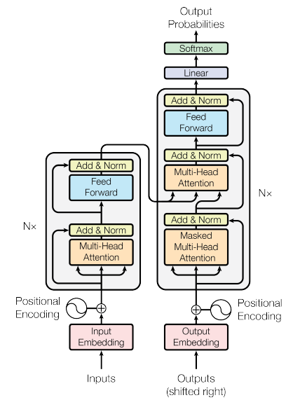

# Understanding Transformer Model Prediction Process

## Overview of Prediction Process

- **Objective**: Understand end-to-end prediction process in transformer architecture.
- **Example Task**: Translation or sequence-to-sequence task.

## Translation Example

1. **Tokenization**:

   - French phrase tokenized using trained tokenizer.
   - Tokens added to encoder side of network, passed through embedding layer, and multi-headed attention layers.
2. **Encoder Output**:

   - Deep representation of input sequence's structure and meaning.
   - Passed into decoder to influence self-attention mechanisms.
3. **Decoder Prediction Loop**:

   - Start-of-sequence token added to decoder input.
   - Contextual understanding from encoder guides decoder to predict next token.
   - Loop continues until end-of-sequence token is predicted.
4. **Output Generation**:

   - Final sequence of tokens detokenized into words to obtain output.
   - Example output: "I love machine learning."

## Variation in Text Generation

- **Multiple Prediction Methods**:
  - Influence creativity and diversity of generated text.
  - Detailed exploration later in the course.

## Summary of Transformer Architecture

- **Encoder-Decoder Components**:

  - Encoder: Encodes input sequences.
  - Decoder: Generates new tokens based on encoder's contextual understanding.
- **Variations**:

  - Encoder-only, Encoder-decoder, and Decoder-only models.
  - Applications and modifications for different tasks.

## Understanding Model Varieties

- **Background Understanding**:
  - Recognize differences between transformer models.
  - Interpret model documentation effectively.

## Importance of Prompt Engineering

- **Natural Language Interaction**:
  - Interaction with transformer models through written prompts, not code.
  - Understanding underlying architecture not necessary for prompt engineering.

## Conclusion

- **Main Goal**: Provide background understanding to distinguish between transformer model varieties.
- **Encouragement**: Reference this overview as needed, no need to remember all details.
- **Next Step**: Explore prompt engineering in the upcoming part of the course.

Understanding the prediction process and variations in transformer models lays the foundation for effective interaction and utilization of these models in natural language tasks. Let's proceed to delve deeper into prompt engineering in the next part of the course.
