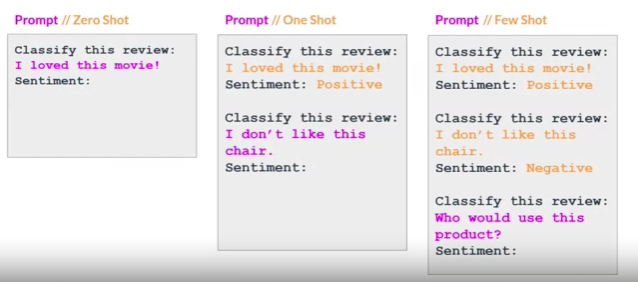

# Prompt Engineering and In-Context Learning

## Terminology Reminder

- **Prompt**: Text fed into the model.
- **Inference**: Generating text.
- **Completion**: Output text.
- **Context Window**: Available memory for the prompt.

## Prompt Engineering

- **Revision Process**:

  - Model may not produce desired outcome initially.
  - Iterative refinement of prompt language or structure.
  - Known as prompt engineering.
- **In-Context Learning**:

  - Include task examples or additional data in the prompt.
  - Helps LLMs grasp task better.
  - Enhances model performance.

## Zero-Shot Inference

- **Example**:
  - Prompt includes instruction and context.
  - Model tasked with classifying sentiment.
  - Model infers task from prompt.
  - Larger models perform well in zero-shot inference.

## One-Shot Inference

- **Enhancement**:
  - Include completed example in prompt.
  - Model learns from single example.
  - Improves performance, especially for smaller models.

## Few-Shot Inference

- **Further Enhancement**:
  - Include multiple examples in prompt.
  - Helps model understand task from varied examples.
  - Boosts performance, especially for smaller models.

## Context Window Consideration

- **Limitation**:
  - In-context learning constrained by context window.
  - Balance between examples and available memory.
  - Fine-tuning option if context window is insufficient.

## Model Scale and Task Performance

- **Scale Impact**:
  - Larger models excel at zero-shot inference.
  - Smaller models limited to tasks similar to training.
  - Experimentation needed to find suitable model.

## Configuration Settings

- **Structure and Style Influence**:
  - Experiment with model settings.
  - Influence completion style and structure.

Understanding prompt engineering and in-context learning enhances model performance across various tasks. Experimentation with model settings allows customization of completion style and structure. Let's explore configuration settings further in the next video.
