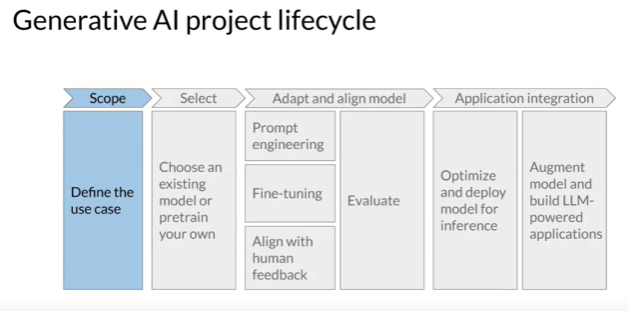

# Study Notes: Generative AI Project Life Cycle

## Introduction

- **Objective**:
  - Develop and deploy an LLM-powered application.
  - Understand the project life cycle from conception to launch.

## Project Life Cycle Overview

- **Diagram**:
  - Presents stages from conception to deployment.
  - Guides project development and decision-making.

## Stages in the Life Cycle

### 1. Define Scope

- **Importance**:
  - Define application's purpose and functionality.
  - Consider LLM capabilities and specific task requirements.

### 2. Model Selection

- **Decision**:
  - Choose between training a model from scratch or using an existing base model.
  - Consider feasibility, resource requirements, and task specificity.

### 3. Performance Assessment

- **Evaluation**:
  - Assess model performance for the intended task.
  - Utilize prompt engineering and in-context learning.
  - Fine-tune model if necessary.

### 4. Adapt and Align

- **Refinement**:
  - Iteratively refine model behavior and alignment with human preferences.
  - Explore prompt engineering, fine-tuning, and reinforcement learning with human feedback.

### 5. Deployment

- **Optimization**:
  - Optimize model for deployment to maximize resource efficiency and user experience.
  - Integrate model with application infrastructure.

### 6. Infrastructure Consideration

- **Enhancements**:
  - Address fundamental limitations of LLMs such as information invention and complex reasoning.
  - Implement techniques to overcome limitations and improve model performance.

## Conclusion

- **Iterative Process**:
  - Project development involves continuous refinement and optimization.
  - Each stage informs the next, leading to a well-performing and aligned application.

Understanding each stage of the life cycle provides a roadmap for effective development and deployment of LLM-powered applications. Continuously refer to the visual representation to navigate through each stage of the course.
